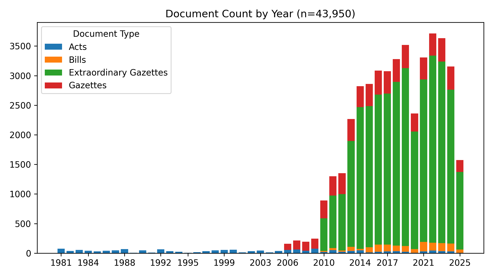
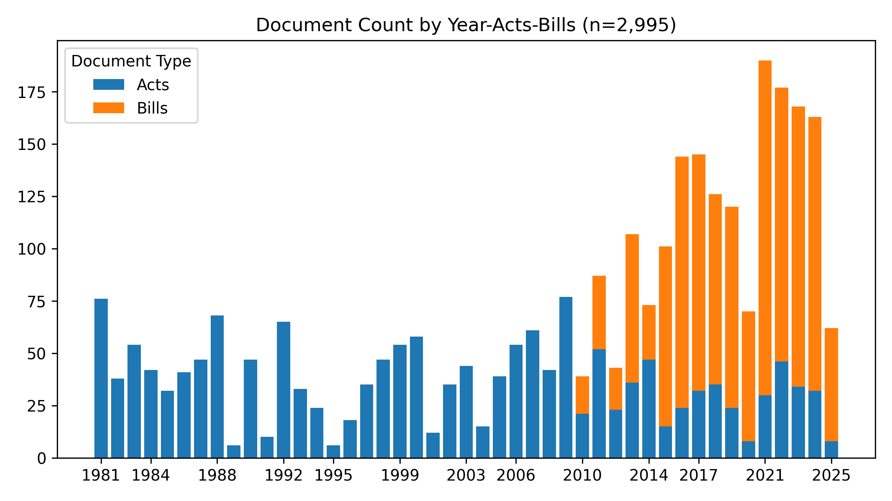
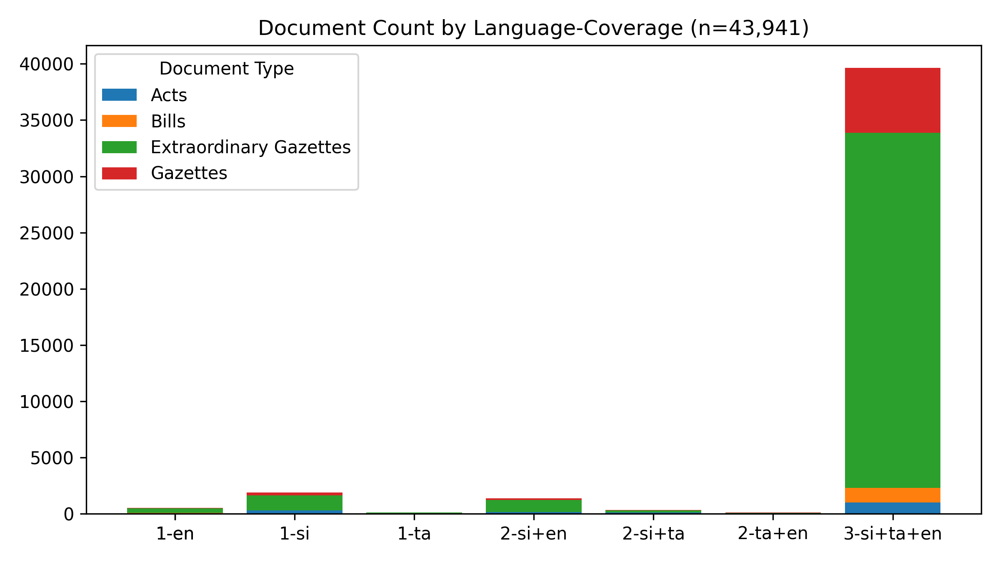
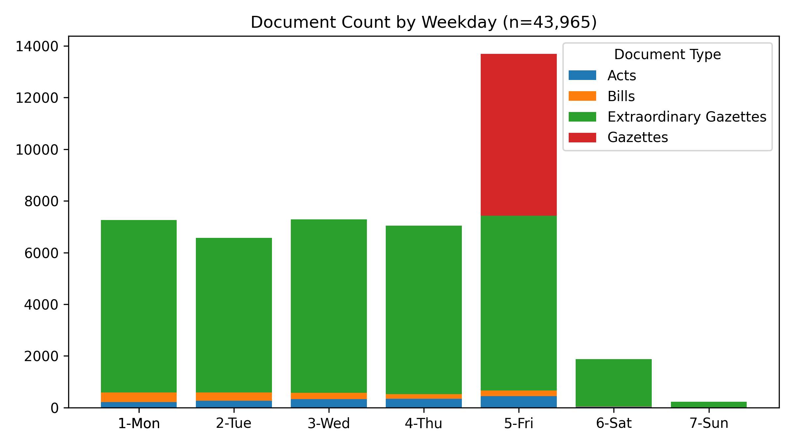

# Legal Documents - #SriLanka 🇱🇰

*Last Updated **2025-07-08 02:52:07**.*

**43,950** documents (58.9 MB), from 1981-01-22 to 2025-07-07.

A collection of 📢 Gazettes, 🚨 Extraordinary Gazettes, 🏛️ Acts, ✍️ Bills and more,  from [documents.gov.lk](https://documents.gov.lk).

🆓 **Public** data, fully open-source – fork freely!

🗣️ **Tri-Lingual** - සිංහල, தமிழ் & English

🔍 **Useful** for Journalists, Researchers, Lawyers & law students, Policy watchers & Citizens who want to stay informed

#Legal #OpenData #GovTech

## Summary Statistics

| doc_type | n | min_date | max_date |
| :-- | --: | :-- | :-- |
| 🚨 Extraordinary Gazettes | 34,690 | 2010-01-01 | 2025-07-07 |
| ✍️ Bills | 1,347 | 2010-05-10 | 2025-07-04 |
| 📢 Gazettes | 6,266 | 2006-03-03 | 2025-07-04 |
| 🏛️ Acts | 1,647 | 1981-01-22 | 2025-06-20 |

## Summary Charts

## Latest Documents

| type | date | title | sources | doc_num |
| :-- | :-- | :-- | :-- | :-- |
| 🚨 | 2025-07-07 | Presidential Secretariat Appointed Secretary to the Ministry Finance Planning and Economic Development | [`සි`](https://documents.gov.lk/view/extra-gazettes/2025/7/2444-09_S.pdf) [`E`](https://documents.gov.lk/view/extra-gazettes/2025/7/2444-09_E.pdf) | [2444/09](data/extra-gazettes/2025/2444-09) |
| 🚨 | 2025-07-07 | Elections Commission Declare Elected as a Member of Parliament under Article 99A of the Constitution Elected Mr UDN Jayaweera as a Member of the Tenth Parliament | [`සි`](https://documents.gov.lk/view/extra-gazettes/2025/7/2444-07_S.pdf) | [2444/07](data/extra-gazettes/2025/2444-07) |
| 🚨 | 2025-07-07 | Election Commission Local Authorities Elections Ordinance Chapter 262 Notice under Section 66 2 Elected to the Members of Akmeemana PS and Bandarawela PS | [`සි`](https://documents.gov.lk/view/extra-gazettes/2025/7/2444-02_S.pdf) [`த`](https://documents.gov.lk/view/extra-gazettes/2025/7/2444-02_T.pdf) [`E`](https://documents.gov.lk/view/extra-gazettes/2025/7/2444-02_E.pdf) | [2444/02](data/extra-gazettes/2025/2444-02) |
| ✍️ | 2025-07-04 | Land Development Amendment GS | [`සි`](https://documents.gov.lk/view/bills/2025/7/617-2025_S.pdf) [`த`](https://documents.gov.lk/view/bills/2025/7/617-2025_T.pdf) [`E`](https://documents.gov.lk/view/bills/2025/7/617-2025_E.pdf) | [617/2025](data/bills/2025/617-2025) |
| 🚨 | 2025-07-04 | Election Commission Elected Chairman and Vice Chairman of 03 Local Government Institutions in Western Province | [`සි`](https://documents.gov.lk/view/extra-gazettes/2025/7/2443-61_S.pdf) | [2443/61](data/extra-gazettes/2025/2443-61) |
| 🚨 | 2025-07-04 | Election Commission Local Authorities Elections Ordinance Chapter 262 Notice under Section 662 Elected to the Members of Biyagama Weraketiya and Thalawa PS | [`සි`](https://documents.gov.lk/view/extra-gazettes/2025/7/2443-60_S.pdf) [`E`](https://documents.gov.lk/view/extra-gazettes/2025/7/2443-60_E.pdf) | [2443/60](data/extra-gazettes/2025/2443-60) |
| 🚨 | 2025-07-04 | Department of Local Government Norther Province Elected Mayor Deputy Mayor Chairman and Vice Chairman in the 1st Meeting of Local Authorities in Norther Province | [`සි`](https://documents.gov.lk/view/extra-gazettes/2025/7/2443-58_S.pdf) [`E`](https://documents.gov.lk/view/extra-gazettes/2025/7/2443-58_E.pdf) | [2443/58](data/extra-gazettes/2025/2443-58) |
| 📢 | 2025-07-04 | Legal Section | [`සි`](https://documents.gov.lk/view/gazettes/2025/7/2025-07-04(II-0)S.pdf) [`E`](https://documents.gov.lk/view/gazettes/2025/7/2025-07-04(II-0)E.pdf) | [2025-07-04-legal-section](data/gazettes/2025/2025-07-04-legal-section) |
| 📢 | 2025-07-04 | Land Section | [`සි`](https://documents.gov.lk/view/gazettes/2025/7/2025-07-04(III-0)S.pdf) [`E`](https://documents.gov.lk/view/gazettes/2025/7/2025-07-04(III-0)E.pdf) | [2025-07-04-land-section](data/gazettes/2025/2025-07-04-land-section) |
| 📢 | 2025-07-04 | IV A Provincial Councils | [`සි`](https://documents.gov.lk/view/gazettes/2025/7/2025-07-04(IV-A)S.pdf) [`E`](https://documents.gov.lk/view/gazettes/2025/7/2025-07-04(IV-A)E.pdf) | [2025-07-04-iv-a-provincial-councils](data/gazettes/2025/2025-07-04-iv-a-provincial-councils) |
| 📢 | 2025-07-04 | III TRADE MARKS AND PATENT NOTICES | [`සි`](https://documents.gov.lk/view/gazettes/2025/7/2025-07-04(I-III)S.pdf) [`E`](https://documents.gov.lk/view/gazettes/2025/7/2025-07-04(I-III)E.pdf) | [2025-07-04-iii-trade-marks-and-patent-notices](data/gazettes/2025/2025-07-04-iii-trade-marks-and-patent-notices) |
| 📢 | 2025-07-04 | IIB Advertising | [`த`](https://documents.gov.lk/view/gazettes/2025/7/2025-07-04(I-IIB)T.pdf) [`E`](https://documents.gov.lk/view/gazettes/2025/7/2025-07-04(I-IIB)E.pdf) | [2025-07-04-iib-advertising](data/gazettes/2025/2025-07-04-iib-advertising) |
| 📢 | 2025-07-04 | IIA Advertising | [`සි`](https://documents.gov.lk/view/gazettes/2025/7/2025-07-04(I-IIA)S.pdf) [`E`](https://documents.gov.lk/view/gazettes/2025/7/2025-07-04(I-IIA)E.pdf) | [2025-07-04-iia-advertising](data/gazettes/2025/2025-07-04-iia-advertising) |
| 📢 | 2025-07-04 | I General | [`සි`](https://documents.gov.lk/view/gazettes/2025/7/2025-07-04(I-I)S.pdf) | [2025-07-04-i-general](data/gazettes/2025/2025-07-04-i-general) |
| ✍️ | 2025-07-03 | Mediation Civil and Commercial Disputes GS | [`සි`](https://documents.gov.lk/view/bills/2025/7/616-2025_S.pdf) [`த`](https://documents.gov.lk/view/bills/2025/7/616-2025_T.pdf) [`E`](https://documents.gov.lk/view/bills/2025/7/616-2025_E.pdf) | [616/2025](data/bills/2025/616-2025) |
| 🚨 | 2025-07-03 | Presidential Secretariat Removal from BMICH Management Membership | [`සි`](https://documents.gov.lk/view/extra-gazettes/2025/7/2443-56_S.pdf) [`த`](https://documents.gov.lk/view/extra-gazettes/2025/7/2443-56_T.pdf) [`E`](https://documents.gov.lk/view/extra-gazettes/2025/7/2443-56_E.pdf) | [2443/56](data/extra-gazettes/2025/2443-56) |
| 🚨 | 2025-07-03 | Election Commission Parliamentary Elections Act No 01 of 1981 Filling of a Vacancy under Section 64 5 | [`සි`](https://documents.gov.lk/view/extra-gazettes/2025/7/2443-50_S.pdf) [`த`](https://documents.gov.lk/view/extra-gazettes/2025/7/2443-50_T.pdf) [`E`](https://documents.gov.lk/view/extra-gazettes/2025/7/2443-50_E.pdf) | [2443/50](data/extra-gazettes/2025/2443-50) |
| 🚨 | 2025-07-01 | Inland Revenue Department Value Added Tax Act No 14 of 2022 Procedure for Collecting and paying VAT | [`සි`](https://documents.gov.lk/view/extra-gazettes/2025/7/2443-30_S.pdf) [`E`](https://documents.gov.lk/view/extra-gazettes/2025/7/2443-30_E.pdf) | [2443/30](data/extra-gazettes/2025/2443-30) |
| 🚨 | 2025-07-01 | Dept of Local Government Western Province Notification Made under Section 66 1 Recall of first Meeting of 04 Local Government Institutions | [`සි`](https://documents.gov.lk/view/extra-gazettes/2025/7/2443-28_S.pdf) | [2443/28](data/extra-gazettes/2025/2443-28) |
| 🚨 | 2025-07-01 | Dept of Local Government N W P Appointed Chairman and Vice Chairman for 03 Local Government Institutions | [`සි`](https://documents.gov.lk/view/extra-gazettes/2025/7/2443-21_S.pdf) [`E`](https://documents.gov.lk/view/extra-gazettes/2025/7/2443-21_E.pdf) | [2443/21](data/extra-gazettes/2025/2443-21) |
| 🚨 | 2025-06-30 | 244315 | [`සි`](https://documents.gov.lk/view/extra-gazettes/2025/6/2443-15_S.pdf) [`E`](https://documents.gov.lk/view/extra-gazettes/2025/6/2443-15_E.pdf) | [2443/15](data/extra-gazettes/2025/2443-15) |
| 🚨 | 2025-06-30 | National Physical Planning Department The Town and Country Planning Ordinance Chapter 269 Declare that the Land called Sankapitti Purana Vihara area as an Urban Development Area | [`සි`](https://documents.gov.lk/view/extra-gazettes/2025/6/2443-10_S.pdf) [`த`](https://documents.gov.lk/view/extra-gazettes/2025/6/2443-10_T.pdf) [`E`](https://documents.gov.lk/view/extra-gazettes/2025/6/2443-10_E.pdf) | [2443/10](data/extra-gazettes/2025/2443-10) |
| 🚨 | 2025-06-30 | Ministry of Health Food Act No26 of 1980 Amended the Food Iodization of Salt Regulation 2023 | [`සි`](https://documents.gov.lk/view/extra-gazettes/2025/6/2443-09_S.pdf) [`த`](https://documents.gov.lk/view/extra-gazettes/2025/6/2443-09_T.pdf) [`E`](https://documents.gov.lk/view/extra-gazettes/2025/6/2443-09_E.pdf) | [2443/09](data/extra-gazettes/2025/2443-09) |
| 🚨 | 2025-06-30 | Ministry of Health Food Act No26 of 1980 Amended the Food Colour Coding for Suger Levels liquid Regulation 2022 | [`සි`](https://documents.gov.lk/view/extra-gazettes/2025/6/2443-08_S.pdf) [`த`](https://documents.gov.lk/view/extra-gazettes/2025/6/2443-08_T.pdf) [`E`](https://documents.gov.lk/view/extra-gazettes/2025/6/2443-08_E.pdf) | [2443/08](data/extra-gazettes/2025/2443-08) |
| 🚨 | 2025-06-30 | Ministry of Health Food Act No26 of 1980 Amended the Food Frans Fat Regulation 2022 | [`සි`](https://documents.gov.lk/view/extra-gazettes/2025/6/2443-07_S.pdf) [`த`](https://documents.gov.lk/view/extra-gazettes/2025/6/2443-07_T.pdf) [`E`](https://documents.gov.lk/view/extra-gazettes/2025/6/2443-07_E.pdf) | [2443/07](data/extra-gazettes/2025/2443-07) |
| 🚨 | 2025-06-30 | Ministry of Health Food Act No26 of 1980 Amended the Food labelling and Advertising Regulations 2023 | [`සි`](https://documents.gov.lk/view/extra-gazettes/2025/6/2443-06_S.pdf) [`த`](https://documents.gov.lk/view/extra-gazettes/2025/6/2443-06_T.pdf) [`E`](https://documents.gov.lk/view/extra-gazettes/2025/6/2443-06_E.pdf) | [2443/06](data/extra-gazettes/2025/2443-06) |
| 🚨 | 2025-06-30 | Sri Lanka Customs Rate Of Exchange with Effect from 30062025 to 06072025 | [`සි`](https://documents.gov.lk/view/extra-gazettes/2025/6/2443-01_S.pdf) [`த`](https://documents.gov.lk/view/extra-gazettes/2025/6/2443-01_T.pdf) [`E`](https://documents.gov.lk/view/extra-gazettes/2025/6/2443-01_E.pdf) | [2443/01](data/extra-gazettes/2025/2443-01) |
| 🚨 | 2025-06-28 | Dept of Local Government Eastern Province Notice under section 66 c Appointed Vice Chairman Kantale Pradeshiya Sabha | [`සි`](https://documents.gov.lk/view/extra-gazettes/2025/6/2442-79_S.pdf) | [2442/79](data/extra-gazettes/2025/2442-79) |
| 🚨 | 2025-06-27 | Presidential Secretariat Call out All the Members of the Armed Forces with effect from 27th June 2025 | [`සි`](https://documents.gov.lk/view/extra-gazettes/2025/6/2442-62_S.pdf) [`த`](https://documents.gov.lk/view/extra-gazettes/2025/6/2442-62_T.pdf) [`E`](https://documents.gov.lk/view/extra-gazettes/2025/6/2442-62_E.pdf) | [2442/62](data/extra-gazettes/2025/2442-62) |
| 🚨 | 2025-06-27 | Department of The Local Government NCP Appointed Chairman and Vice Chairman for the Anuradgapura Local Authorities 2025 | [`සි`](https://documents.gov.lk/view/extra-gazettes/2025/6/2442-61_S.pdf) [`த`](https://documents.gov.lk/view/extra-gazettes/2025/6/2442-61_T.pdf) [`E`](https://documents.gov.lk/view/extra-gazettes/2025/6/2442-61_E.pdf) | [2442/61](data/extra-gazettes/2025/2442-61) |

## All Documents

| type | date | title | sources | doc_num |
| :-- | :-- | :-- | :-- | :-- |
| 🚨 | 2025-07-07 | Presidential Secretariat Appointed Secretary to the Ministry Finance Planning and Economic Development | [`සි`](https://documents.gov.lk/view/extra-gazettes/2025/7/2444-09_S.pdf) [`E`](https://documents.gov.lk/view/extra-gazettes/2025/7/2444-09_E.pdf) | [2444/09](data/extra-gazettes/2025/2444-09) |
| 🚨 | 2025-01-15 | Land Aquisition Upatissagama Helambagaswewa DS Division Anuradapura District Pahalamalwathu oya Jalashaya Project Amendment | [`සි`](https://documents.gov.lk/view/extra-gazettes/2025/1/2419-06_S.pdf) [`த`](https://documents.gov.lk/view/extra-gazettes/2025/1/2419-06_T.pdf) [`E`](https://documents.gov.lk/view/extra-gazettes/2025/1/2419-06_E.pdf) | [2419/06](data/extra-gazettes/2025/2419-06) |
| 🚨 | 2024-08-02 | Land Title Settlement Department Dehiwala Dehiwala DS Division Colombo District Cad Map No 520807 24120044 | [`සි`](https://documents.gov.lk/view/extra-gazettes/2024/8/2395-53_S.pdf) [`த`](https://documents.gov.lk/view/extra-gazettes/2024/8/2395-53_T.pdf) [`E`](https://documents.gov.lk/view/extra-gazettes/2024/8/2395-53_E.pdf) | [2395/53](data/extra-gazettes/2024/2395-53) |
| 🚨 | 2024-02-02 | Land Title Settlement Department Lunuwila Wennappuwa DS Division Puttalam District Cad Map No 410004 230823 | [`සි`](https://documents.gov.lk/view/extra-gazettes/2024/2/2369-55_S.pdf) [`த`](https://documents.gov.lk/view/extra-gazettes/2024/2/2369-55_T.pdf) [`E`](https://documents.gov.lk/view/extra-gazettes/2024/2/2369-55_E.pdf) | [2369/55](data/extra-gazettes/2024/2369-55) |
| 🚨 | 2023-09-12 | Presidential Secretariat Order Necessary Essential Public Service for the Purpose of the Community Essential Public Service Act No 61 of 1979 | [`සි`](https://documents.gov.lk/view/extra-gazettes/2023/9/2349-19_S.pdf) [`த`](https://documents.gov.lk/view/extra-gazettes/2023/9/2349-19_T.pdf) [`E`](https://documents.gov.lk/view/extra-gazettes/2023/9/2349-19_E.pdf) | [2349/19](data/extra-gazettes/2023/2349-19) |
| 🚨 | 2023-04-01 | Land Acquisition Wagollakada Horowpothana DS Division Anuradhapura District | [`සි`](https://documents.gov.lk/view/extra-gazettes/2023/4/2325-84_S.pdf) [`த`](https://documents.gov.lk/view/extra-gazettes/2023/4/2325-84_T.pdf) [`E`](https://documents.gov.lk/view/extra-gazettes/2023/4/2325-84_E.pdf) | [2325/84](data/extra-gazettes/2023/2325-84) |
| 📢 | 2022-11-25 | IIB Advertising | [`සි`](https://documents.gov.lk/view/gazettes/2022/11/2022-11-25(I-IIB)S.pdf) [`த`](https://documents.gov.lk/view/gazettes/2022/11/2022-11-25(I-IIB)T.pdf) [`E`](https://documents.gov.lk/view/gazettes/2022/11/2022-11-25(I-IIB)E.pdf) | [2022-11-25-iib-advertising](data/gazettes/2022/2022-11-25-iib-advertising) |
| 🚨 | 2022-07-12 | Ministry of Justice Prison Affairs and Constitutional Reforms Rules made under the Prison Ordinance | [`සි`](https://documents.gov.lk/view/extra-gazettes/2022/7/2288-15_S.pdf) [`த`](https://documents.gov.lk/view/extra-gazettes/2022/7/2288-15_T.pdf) [`E`](https://documents.gov.lk/view/extra-gazettes/2022/7/2288-15_E.pdf) | [2288/15](data/extra-gazettes/2022/2288-15) |
| 🚨 | 2022-02-02 | Ministry of Labour The Industrial Dispute between Mr P D Somasiri No 13 Paramulla Alawwa and Sri Lanka Transport Board No 210 Kirula Road Colombo 05 E only | [`E`](https://documents.gov.lk/view/extra-gazettes/2022/2/2265-33_E.pdf) | [2265/33](data/extra-gazettes/2022/2265-33) |
| 🚨 | 2021-09-10 | Land Title Settlement Department Thalatuwa Kurunegala DS Division Kurunegala District Cad Map No 420352 | [`සි`](https://documents.gov.lk/view/extra-gazettes/2021/9/2244-26_S.pdf) [`த`](https://documents.gov.lk/view/extra-gazettes/2021/9/2244-26_T.pdf) [`E`](https://documents.gov.lk/view/extra-gazettes/2021/9/2244-26_E.pdf) | [2244/26](data/extra-gazettes/2021/2244-26) |
| 🚨 | 2021-03-09 | Central Bank of Sri Lanka Repatriation of Export Proceeds into Sri Lanka Rules No 2 of 2021 | [`සි`](https://documents.gov.lk/view/extra-gazettes/2021/3/2218-38_S.pdf) [`த`](https://documents.gov.lk/view/extra-gazettes/2021/3/2218-38_T.pdf) [`E`](https://documents.gov.lk/view/extra-gazettes/2021/3/2218-38_E.pdf) | [2218/38](data/extra-gazettes/2021/2218-38) |
| 📢 | 2020-09-11 | IV B Local Government | [`සි`](https://documents.gov.lk/view/gazettes/2020/9/2020-09-11(IV-B)S.pdf) [`த`](https://documents.gov.lk/view/gazettes/2020/9/2020-09-11(IV-B)T.pdf) [`E`](https://documents.gov.lk/view/gazettes/2020/9/2020-09-11(IV-B)E.pdf) | [2020-09-11-iv-b-local-government](data/gazettes/2020/2020-09-11-iv-b-local-government) |
| 🚨 | 2020-01-23 | Election Commission Revision of Registers of Electors for the Year 2019 Colombo District | [`සි`](https://documents.gov.lk/view/extra-gazettes/2020/1/2159-23_S.pdf) [`த`](https://documents.gov.lk/view/extra-gazettes/2020/1/2159-23_T.pdf) | [2159/23](data/extra-gazettes/2020/2159-23) |
| 🚨 | 2019-08-23 | Ministry of Public Administration 5th Amendment to the service Minute of the Sri Lanka Architects Service | [`සි`](https://documents.gov.lk/view/extra-gazettes/2019/8/2137-88_S.pdf) [`E`](https://documents.gov.lk/view/extra-gazettes/2019/8/2137-88_E.pdf) | [2137/88](data/extra-gazettes/2019/2137-88) |
| 🚨 | 2019-03-26 | Land Acquisition Redemption the lands in Gangodawila Kalubowila Pepiliyana Maharagama Kesbewa Dehiwala DS Divisions Colombo District | [`සි`](https://documents.gov.lk/view/extra-gazettes/2019/3/2116-12_S.pdf) [`த`](https://documents.gov.lk/view/extra-gazettes/2019/3/2116-12_T.pdf) [`E`](https://documents.gov.lk/view/extra-gazettes/2019/3/2116-12_E.pdf) | [2116/12](data/extra-gazettes/2019/2116-12) |
| 🚨 | 2018-10-03 | Land Acquisition Aparekka Devinuwara DS Division Matara District | [`සි`](https://documents.gov.lk/view/extra-gazettes/2018/10/2091-43_S.pdf) [`த`](https://documents.gov.lk/view/extra-gazettes/2018/10/2091-43_T.pdf) [`E`](https://documents.gov.lk/view/extra-gazettes/2018/10/2091-43_E.pdf) | [2091/43](data/extra-gazettes/2018/2091-43) |
| 🚨 | 2018-05-11 | Land Title Settlement Department Pallegama Dambulla DS Division Matale District Cad Map No 310011 | [`සි`](https://documents.gov.lk/view/extra-gazettes/2018/5/2070-44_S.pdf) [`த`](https://documents.gov.lk/view/extra-gazettes/2018/5/2070-44_T.pdf) [`E`](https://documents.gov.lk/view/extra-gazettes/2018/5/2070-44_E.pdf) | [2070/44](data/extra-gazettes/2018/2070-44) |
| 🚨 | 2017-11-22 | Land Title Settlement Department Rawathawattha Moratuwa DS Division Colombo District Cad Map No 520201 | [`සි`](https://documents.gov.lk/view/extra-gazettes/2017/11/2046-31_S.pdf) [`த`](https://documents.gov.lk/view/extra-gazettes/2017/11/2046-31_T.pdf) [`E`](https://documents.gov.lk/view/extra-gazettes/2017/11/2046-31_E.pdf) | [2046/31](data/extra-gazettes/2017/2046-31) |
| 📢 | 2017-06-02 | Land Section | [`සි`](https://documents.gov.lk/view/gazettes/2017/6/2017-06-02(III-0)S.pdf) [`த`](https://documents.gov.lk/view/gazettes/2017/6/2017-06-02(III-0)T.pdf) [`E`](https://documents.gov.lk/view/gazettes/2017/6/2017-06-02(III-0)E.pdf) | [2017-06-02-land-section](data/gazettes/2017/2017-06-02-land-section) |
| 🚨 | 2016-12-02 | Department of Trade and Investment Policy RPO No 072016 Order made to require the Director General of Customs to demand and levy an Import Duty on Lubricating preparations etc wef 03122016 | [`සි`](https://documents.gov.lk/view/extra-gazettes/2016/12/1995-37_S.pdf) [`த`](https://documents.gov.lk/view/extra-gazettes/2016/12/1995-37_T.pdf) [`E`](https://documents.gov.lk/view/extra-gazettes/2016/12/1995-37_E.pdf) | [1995/37](data/extra-gazettes/2016/1995-37) |
| 🚨 | 2016-06-28 | Land Title Settlement Department Kohuwala Dehiwala DS Division Colombo District Cad Map No520801 | [`සි`](https://documents.gov.lk/view/extra-gazettes/2016/6/1973-13_S.pdf) [`த`](https://documents.gov.lk/view/extra-gazettes/2016/6/1973-13_T.pdf) [`E`](https://documents.gov.lk/view/extra-gazettes/2016/6/1973-13_E.pdf) | [1973/13](data/extra-gazettes/2016/1973-13) |
| 🚨 | 2015-12-22 | Land Title Settlement Department Aluthgama Bogamuwa Gampaha DS Division Gampaha District Cad Map No 511800 | [`සි`](https://documents.gov.lk/view/extra-gazettes/2015/12/1946-20_S.pdf) [`த`](https://documents.gov.lk/view/extra-gazettes/2015/12/1946-20_T.pdf) [`E`](https://documents.gov.lk/view/extra-gazettes/2015/12/1946-20_E.pdf) | [1946/20](data/extra-gazettes/2015/1946-20) |
| 🚨 | 2015-06-24 | Land Title Settlement Department KiribathkumburaWest Yatinuwara DS Division Kandy District Cad Map No 320552 | [`සි`](https://documents.gov.lk/view/extra-gazettes/2015/6/1920-12_S.pdf) [`த`](https://documents.gov.lk/view/extra-gazettes/2015/6/1920-12_T.pdf) [`E`](https://documents.gov.lk/view/extra-gazettes/2015/6/1920-12_E.pdf) | [1920/12](data/extra-gazettes/2015/1920-12) |
| 🚨 | 2014-12-09 | Land Title Settlement Department Gaspe Meerigama DS Division Gampaha District Cad Map No 510213 | [`සි`](https://documents.gov.lk/view/extra-gazettes/2014/12/1892-16_S.pdf) [`த`](https://documents.gov.lk/view/extra-gazettes/2014/12/1892-16_T.pdf) [`E`](https://documents.gov.lk/view/extra-gazettes/2014/12/1892-16_E.pdf) | [1892/16](data/extra-gazettes/2014/1892-16) |
| 🚨 | 2014-06-06 | Dept of Elections Vacating the office of Member of Valikamam East Pradesiya Sabha by Mr Kirushnapillai Selvarasa Amendment to the Notice published in Gaz Ex No 186307 of 19052014 | [`සි`](https://documents.gov.lk/view/extra-gazettes/2014/6/1865-42_S.pdf) [`த`](https://documents.gov.lk/view/extra-gazettes/2014/6/1865-42_T.pdf) [`E`](https://documents.gov.lk/view/extra-gazettes/2014/6/1865-42_E.pdf) | [1865/42](data/extra-gazettes/2014/1865-42) |
| 🚨 | 2013-11-28 | Land Title Settlement Dept Allagala Tissamaharamaya DS Division Hambanthota District Cad Map No 830017 | [`සි`](https://documents.gov.lk/view/extra-gazettes/2013/11/1838-43_S.pdf) [`த`](https://documents.gov.lk/view/extra-gazettes/2013/11/1838-43_T.pdf) [`E`](https://documents.gov.lk/view/extra-gazettes/2013/11/1838-43_E.pdf) | [1838/43](data/extra-gazettes/2013/1838-43) |
| 🚨 | 2013-04-08 | Presidential Secretariat Appointments of Secretaries to the 1Ministry of State Resourses Enterprise Development 2 Secretary to the Ministry of Fisheries Aquatic Resources Development 3 Appointment of Chief Secretary of the Western Province | [`සි`](https://documents.gov.lk/view/extra-gazettes/2013/4/1805-04_S.pdf) [`த`](https://documents.gov.lk/view/extra-gazettes/2013/4/1805-04_T.pdf) [`E`](https://documents.gov.lk/view/extra-gazettes/2013/4/1805-04_E.pdf) | [1805/04](data/extra-gazettes/2013/1805-04) |
| 🚨 | 2012-06-29 | Presidential Secretariat Appointed Mr S M G Jayarathne as Secretary of the Ministry of Education and Mr H M Gunasekara as Secretary of the Telecommunication Information Technology | [`සි`](https://documents.gov.lk/view/extra-gazettes/2012/6/1764-27_S.pdf) [`த`](https://documents.gov.lk/view/extra-gazettes/2012/6/1764-27_T.pdf) [`E`](https://documents.gov.lk/view/extra-gazettes/2012/6/1764-27_E.pdf) | [1764/27](data/extra-gazettes/2012/1764-27) |
| 🚨 | 2011-03-04 | Ministry of Sports Sports Law No 25 of 1973 Amendment to the Gaz Ex No 1103 of 07051974 | [`සි`](https://documents.gov.lk/view/extra-gazettes/2011/3/1695-25_S.pdf) [`த`](https://documents.gov.lk/view/extra-gazettes/2011/3/1695-25_T.pdf) [`E`](https://documents.gov.lk/view/extra-gazettes/2011/3/1695-25_E.pdf) | [1695/25](data/extra-gazettes/2011/1695-25) |
| 📢 | 2008-09-26 | IIA Advertising | [`සි`](https://documents.gov.lk/view/gazettes/2008/9/2008-09-26(I-IIA)S.pdf) [`த`](https://documents.gov.lk/view/gazettes/2008/9/2008-09-26(I-IIA)T.pdf) [`E`](https://documents.gov.lk/view/gazettes/2008/9/2008-09-26(I-IIA)E.pdf) | [2008-09-26-iia-advertising](data/gazettes/2008/2008-09-26-iia-advertising) |
| 🏛️ | 1981-01-22 | Parliamentary Elections | [`සි`](https://documents.gov.lk/view/acts/1981/1/01-1981_S.pdf) | [01/1981](data/acts/1981/01-1981) |

*(Uniformly Spaced Sample of 30 from 43,950)*

## Interesting Documents

### Documents Published on a Sunday

| type | date | title | sources | doc_num |
| :-- | :-- | :-- | :-- | :-- |
| 🚨 | 2025-04-27 | Land Title Settlement Department Makulawa Galle Four Gravets DSD Galle District 241026 | [`සි`](https://documents.gov.lk/view/extra-gazettes/2025/4/2433-50_S.pdf) [`E`](https://documents.gov.lk/view/extra-gazettes/2025/4/2433-50_E.pdf) | [2433/50](data/extra-gazettes/2025/2433-50) |
| 🚨 | 2024-12-22 | Department of Fiscal Policy Regulation of Insurance Industry Act No43 of 2000 | [`සි`](https://documents.gov.lk/view/extra-gazettes/2024/12/2415-79_S.pdf) [`E`](https://documents.gov.lk/view/extra-gazettes/2024/12/2415-79_E.pdf) | [2415/79](data/extra-gazettes/2024/2415-79) |
| 🚨 | 2024-09-22 | Election Commission Mr Anura Kumara Dissanayake Has Been Declared Elected as the President of the Democratic Socialist Republic of Sri Lanka | [`සි`](https://documents.gov.lk/view/extra-gazettes/2024/9/2402-26_S.pdf) [`த`](https://documents.gov.lk/view/extra-gazettes/2024/9/2402-26_T.pdf) [`E`](https://documents.gov.lk/view/extra-gazettes/2024/9/2402-26_E.pdf) | [2402/26](data/extra-gazettes/2024/2402-26) |
| 🚨 | 2024-09-01 | Land Title Settlement Department Kudapaduwa Negombo DS Division Gampaha District Cad Map No 511424 240439 | [`සි`](https://documents.gov.lk/view/extra-gazettes/2024/9/2399-50_S.pdf) [`த`](https://documents.gov.lk/view/extra-gazettes/2024/9/2399-50_T.pdf) [`E`](https://documents.gov.lk/view/extra-gazettes/2024/9/2399-50_E.pdf) | [2399/50](data/extra-gazettes/2024/2399-50) |
| 🚨 | 2024-08-11 | Land Title Settlement Department Makkinigoda Meerigama DSDivision Gampaha District Cad Map No510289 2455032 | [`සි`](https://documents.gov.lk/view/extra-gazettes/2024/8/2396-68_S.pdf) [`த`](https://documents.gov.lk/view/extra-gazettes/2024/8/2396-68_T.pdf) [`E`](https://documents.gov.lk/view/extra-gazettes/2024/8/2396-68_E.pdf) | [2396/68](data/extra-gazettes/2024/2396-68) |
| 🚨 | 2022-07-31 | Presidential Secretariat The Public Security Ordinance Chapter 40 Notice under Section 27 | [`සි`](https://documents.gov.lk/view/extra-gazettes/2022/7/2290-37_S.pdf) [`த`](https://documents.gov.lk/view/extra-gazettes/2022/7/2290-37_T.pdf) [`E`](https://documents.gov.lk/view/extra-gazettes/2022/7/2290-37_E.pdf) | [2290/37](data/extra-gazettes/2022/2290-37) |
| 🚨 | 2020-11-08 | Governors Office Western Province Entertainment Tax Ordinance Sri Jayawardenapura Kotte MC and Horana UC | [`සි`](https://documents.gov.lk/view/extra-gazettes/2020/11/2200-08_S.pdf) [`த`](https://documents.gov.lk/view/extra-gazettes/2020/11/2200-08_T.pdf) [`E`](https://documents.gov.lk/view/extra-gazettes/2020/11/2200-08_E.pdf) | [2200/08](data/extra-gazettes/2020/2200-08) |
| 🚨 | 2019-10-27 | Election Commission Media Guidelines published by the Election Commission | [`සි`](https://documents.gov.lk/view/extra-gazettes/2019/10/2146-39_S.pdf) [`த`](https://documents.gov.lk/view/extra-gazettes/2019/10/2146-39_T.pdf) [`E`](https://documents.gov.lk/view/extra-gazettes/2019/10/2146-39_E.pdf) | [2146/39](data/extra-gazettes/2019/2146-39) |
| 🚨 | 2018-04-01 | Department of Inland Revenue Notice in relation to the circumstances in which losses on financial instruments | [`සි`](https://documents.gov.lk/view/extra-gazettes/2018/4/2064-55_S.pdf) [`த`](https://documents.gov.lk/view/extra-gazettes/2018/4/2064-55_T.pdf) [`E`](https://documents.gov.lk/view/extra-gazettes/2018/4/2064-55_E.pdf) | [2064/55](data/extra-gazettes/2018/2064-55) |
| 🚨 | 2014-06-01 | Dept of Census and Statistics The Colombo Consumers Price Index for the month of May 2014 was 1795 | [`සි`](https://documents.gov.lk/view/extra-gazettes/2014/6/1864-63_S.pdf) [`த`](https://documents.gov.lk/view/extra-gazettes/2014/6/1864-63_T.pdf) [`E`](https://documents.gov.lk/view/extra-gazettes/2014/6/1864-63_E.pdf) | [1864/63](data/extra-gazettes/2014/1864-63) |
| 🏛️ | 1988-12-18 | J R Jayewardene Centre | [`සි`](https://documents.gov.lk/view/acts/1988/12/77-1988_S.pdf) | [77/1988](data/acts/1988/77-1988) |

*(Uniformly Spaced Sample of 10 from 233)*

## PDF Data

This repository contains only metadata about the documents, to save space and avoid issues with large files.

The actual PDFs are downloaded in parallel and stored in the companion repository, [lk_legal_docs_data](https://github.com/nuuuwan/lk_legal_docs_data).

Currently, PDFs for **788** documents have been downloaded.

## Scraper Information

- HTML-Cache = 0.0 MB 
