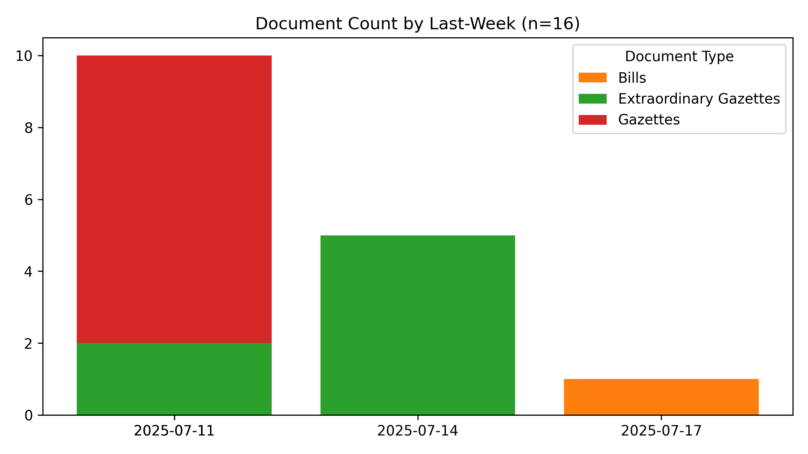

# #SriLanka 🇱🇰 - Legal Documents #Dataset

*Last Updated **2025-07-09 22:54:30**.*

**43,969** documents (40.9 MB), from 1981-01-22 to 2025-07-08.

A collection of 📢 Gazettes, 🚨 Extraordinary Gazettes, 🏛️ Acts, ✍️ Bills and more,  from [documents.gov.lk](https://documents.gov.lk).

🆓 **Public** data, fully open-source – fork freely!

🗣️ **Tri-Lingual** - සිංහල, தமிழ் & English

🔍 **Useful** for Journalists, Researchers, Lawyers & law students, Policy watchers & Citizens who want to stay informed

🐞 **#WorkInProgress** - Suggestions, Questions, Ideas, [Bug Reports](https://github.com/nuuuwan/lk_legal_docs/issues) are welcome!

#Legal #OpenData #GovTech

📄 Currently, 8,556 PDFs (5.2 GB) for **3,099** documents (7.0%) have been downloaded. Final data size is estimated to be ~73 GB.

## Summary Statistics

| doc_type | n | min_date | max_date |
| :-- | --: | :-- | :-- |
| ✍️ Bills | 1,348 | 2010-05-10 | 2025-07-08 |
| 🚨 Extraordinary Gazettes | 34,707 | 2010-01-01 | 2025-07-07 |
| 📢 Gazettes | 6,267 | 2006-03-03 | 2025-07-04 |
| 🏛️ Acts | 1,647 | 1981-01-22 | 2025-06-20 |

## Summary Charts

## Recent Documents (Published during the last 7 days)

**24** Documents

- ✍️ [2025-07-08] [Penal Code (Amendment) - GS](https://github.com/nuuuwan/lk_legal_docs_data/tree/main/data/bills/2025/618-2025)
- 🚨 [2025-07-07] [Presidential Secretariat - Appointed Secretary to the Ministry Finance Planning and Economic Development](https://github.com/nuuuwan/lk_legal_docs_data/tree/main/data/extra-gazettes/2025/2444-09)
- 🚨 [2025-07-07] [Elections Commission - Declare Elected as a Member of Parliament under Article 99A of the Constitution (Elected Mr. U.D.N. Jayaweera as a Member of the Tenth Parliament)](https://github.com/nuuuwan/lk_legal_docs_data/tree/main/data/extra-gazettes/2025/2444-07)
- 🚨 [2025-07-07] [Election Commission - Local Authorities Elections Ordinance (Chapter 262) - Notice under Section 66 (2) "Elected to the Members of Akmeemana P.S and Bandarawela P.S](https://github.com/nuuuwan/lk_legal_docs_data/tree/main/data/extra-gazettes/2025/2444-02)
- 🚨 [2025-07-07] [Sri Lanka Customs - Rates of Exchange with effect from 07.07.2025 to 13.07.2025](https://github.com/nuuuwan/lk_legal_docs_data/tree/main/data/extra-gazettes/2025/2444-01)
- ✍️ [2025-07-04] [Land Development (Amendment) - GS](https://github.com/nuuuwan/lk_legal_docs_data/tree/main/data/bills/2025/617-2025)
- 🚨 [2025-07-04] [2443/70](https://github.com/nuuuwan/lk_legal_docs_data/tree/main/data/extra-gazettes/2025/2443-70)
- 🚨 [2025-07-04] [Election Commission - Elected Chairman and Vice Chairman of 03 Local Government Institutions in Western Province](https://github.com/nuuuwan/lk_legal_docs_data/tree/main/data/extra-gazettes/2025/2443-61)
- 🚨 [2025-07-04] [Election Commission - Local Authorities Elections Ordinance (Chapter 262) Notice under Section 66(2) Elected to the Members of Biyagama, Weraketiya and Thalawa P.S](https://github.com/nuuuwan/lk_legal_docs_data/tree/main/data/extra-gazettes/2025/2443-60)
- 🚨 [2025-07-04] [Department of Local Government - Norther Province - Elected Mayor, Deputy Mayor, Chairman and Vice Chairman in the 1st Meeting of Local Authorities in Norther Province](https://github.com/nuuuwan/lk_legal_docs_data/tree/main/data/extra-gazettes/2025/2443-58)
- 🚨 [2025-07-04] [Central Bank of Sri Lanka - Appointment of an Administrator to Nation Lanka Finance PLC](https://github.com/nuuuwan/lk_legal_docs_data/tree/main/data/extra-gazettes/2025/2443-57)
- 📢 [2025-07-04] [Legal Section](https://github.com/nuuuwan/lk_legal_docs_data/tree/main/data/gazettes/2025/2025-07-04-legal-section)
- 📢 [2025-07-04] [Land Section](https://github.com/nuuuwan/lk_legal_docs_data/tree/main/data/gazettes/2025/2025-07-04-land-section)
- 📢 [2025-07-04] [IV (B) - Local Government](https://github.com/nuuuwan/lk_legal_docs_data/tree/main/data/gazettes/2025/2025-07-04-iv-b-local-government)
- 📢 [2025-07-04] [IV (A) - Provincial Councils](https://github.com/nuuuwan/lk_legal_docs_data/tree/main/data/gazettes/2025/2025-07-04-iv-a-provincial-councils)
- 📢 [2025-07-04] [(III) - TRADE MARKS AND PATENT NOTICES](https://github.com/nuuuwan/lk_legal_docs_data/tree/main/data/gazettes/2025/2025-07-04-iii-trade-marks-and-patent-notices)
- 📢 [2025-07-04] [(IIB) - Advertising](https://github.com/nuuuwan/lk_legal_docs_data/tree/main/data/gazettes/2025/2025-07-04-iib-advertising)
- 📢 [2025-07-04] [(IIA) - Advertising](https://github.com/nuuuwan/lk_legal_docs_data/tree/main/data/gazettes/2025/2025-07-04-iia-advertising)
- 📢 [2025-07-04] [(I) - General](https://github.com/nuuuwan/lk_legal_docs_data/tree/main/data/gazettes/2025/2025-07-04-i-general)
- ✍️ [2025-07-03] [Mediation (Civil and Commercial Disputes) - GS](https://github.com/nuuuwan/lk_legal_docs_data/tree/main/data/bills/2025/616-2025)
- 🚨 [2025-07-03] [Presidential Secretariat - Removal from BMICH Management Membership](https://github.com/nuuuwan/lk_legal_docs_data/tree/main/data/extra-gazettes/2025/2443-56)
- 🚨 [2025-07-03] [Ministry of Urban Development, Construction and Housing - National Water Supply and Drainage Board Act, No 02 of1974 Order under Section 92](https://github.com/nuuuwan/lk_legal_docs_data/tree/main/data/extra-gazettes/2025/2443-53)
- 🚨 [2025-07-03] [Department of Local Government - UVA Province - Appointed Mayor, Deputy Mayor, Chairman and Vice Chairman for 12 Local Government Institutions](https://github.com/nuuuwan/lk_legal_docs_data/tree/main/data/extra-gazettes/2025/2443-51)
- 🚨 [2025-07-03] [Election Commission - Parliamentary Elections Act. No 01 of 1981 Filling of a Vacancy under Section 64 (5)](https://github.com/nuuuwan/lk_legal_docs_data/tree/main/data/extra-gazettes/2025/2443-50)

## Contents

### By Document Type

- [✍️ Bills](readme/contents-document-type-bills.md) (1,348 documents)
- [🚨 Extraordinary Gazettes](readme/contents-document-type-extra-gazettes.md) (34,707 documents)
- [📢 Gazettes](readme/contents-document-type-gazettes.md) (6,267 documents)
- [🏛️ Acts](readme/contents-document-type-acts.md) (1,647 documents)

### By Decade

- [2020s](readme/contents-decade-2020s.md) (17,760 documents)
- [2010s](readme/contents-decade-2010s.md) (24,451 documents)
- [2000s](readme/contents-decade-2000s.md) (1,015 documents)
- [1990s](readme/contents-decade-1990s.md) (339 documents)
- [1980s](readme/contents-decade-1980s.md) (404 documents)
