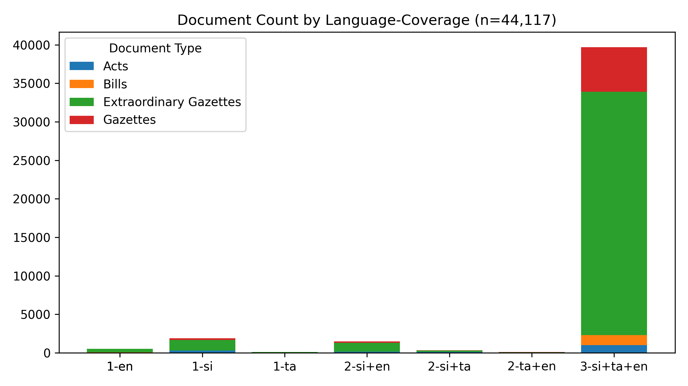

# #SriLanka 🇱🇰 - Legal Documents #Dataset

*Last Updated **2025-07-25 14:28:04**.*

**44,110** documents (40.9 MB), from 1981-01-22 to 2025-07-25.

A collection of 📢 Gazettes, 🚨 Extraordinary Gazettes, 🏛️ Acts, ✍️ Bills and more,  from [documents.gov.lk](https://documents.gov.lk).

🆓 **Public** data, fully open-source – fork freely!

🗣️ **Tri-Lingual** - සිංහල, தமிழ் & English

🔍 **Useful** for Journalists, Researchers, Lawyers & law students, Policy watchers & Citizens who want to stay informed

🐞 **#WorkInProgress** - Suggestions, Questions, Ideas, [Bug Reports](https://github.com/nuuuwan/lk_legal_docs/issues) are welcome!

#Legal #OpenData #GovTech

📄 Currently, 74,225 PDFs (28.5 GB) for **26,505** documents (60.1%) have been downloaded. Final data size is estimated to be ~47 GB.

## 🆕 The Legal Documents App

You can browse this dataset using [http://nuuuwan.github.io/lk_legal_docs_app/](http://nuuuwan.github.io/lk_legal_docs_app/).

For best results, use a desktop browser.

## Summary Statistics

| doc_type | n | min_date | max_date |
| :-- | --: | :-- | :-- |
| 📢 Gazettes | 6,285 | 2006-03-03 | 2025-07-25 |
| 🚨 Extraordinary Gazettes | 34,825 | 2010-01-01 | 2025-07-23 |
| ✍️ Bills | 1,353 | 2010-05-10 | 2025-07-18 |
| 🏛️ Acts | 1,647 | 1981-01-22 | 2025-06-20 |

## Summary Charts

## Recent Documents (Published during the last 7 days)

**17** Documents

- 📢 [2025-07-25] [Legal Section](https://github.com/nuuuwan/lk_legal_docs_data/tree/main/data/gazettes/2025/2025-07-25-legal-section)
- 📢 [2025-07-25] [IV (A) - Provincial Councils](https://github.com/nuuuwan/lk_legal_docs_data/tree/main/data/gazettes/2025/2025-07-25-iv-a-provincial-councils)
- 🚨 [2025-07-23] [Telecommunications Regulatory Commission of Sri Lanka - Sri Lanka Telecommunication Act, No 25 of 1991 Amended Provider License Rules under Section 17 B](https://github.com/nuuuwan/lk_legal_docs_data/tree/main/data/extra-gazettes/2025/2446-42)
- 🚨 [2025-07-22] [Department of Census and Statistics - National Consumer Price Index - June 2025](https://github.com/nuuuwan/lk_legal_docs_data/tree/main/data/extra-gazettes/2025/2446-35)
- 🚨 [2025-07-21] [National Medicines Regulatory Authority - Medicines (Pricing Mechanism for Medicines) Regulations No. 02 of 2025.](https://github.com/nuuuwan/lk_legal_docs_data/tree/main/data/extra-gazettes/2025/2446-34)
- 🚨 [2025-07-21] [Sri Lanka Customs - Rates of Exchange with effect from 21.07.2025 to 27.07.2025](https://github.com/nuuuwan/lk_legal_docs_data/tree/main/data/extra-gazettes/2025/2446-01)
- ✍️ [2025-07-18] [Institute of Facilities Management Sri Lanka (Incorporation) - GS](https://github.com/nuuuwan/lk_legal_docs_data/tree/main/data/bills/2025/623-2025)
- 🚨 [2025-07-18] [Dept. of Local Government - Eastern Province Notice Under Section 66 (C) Summon the meeting fill the Vacancy for the Post of Lahugala Pradeshiya Sabha](https://github.com/nuuuwan/lk_legal_docs_data/tree/main/data/extra-gazettes/2025/2445-58)
- 🚨 [2025-07-18] [2445/21](https://github.com/nuuuwan/lk_legal_docs_data/tree/main/data/extra-gazettes/2025/2445-21)
- 📢 [2025-07-18] [Legal Section](https://github.com/nuuuwan/lk_legal_docs_data/tree/main/data/gazettes/2025/2025-07-18-legal-section)
- 📢 [2025-07-18] [Land Section](https://github.com/nuuuwan/lk_legal_docs_data/tree/main/data/gazettes/2025/2025-07-18-land-section)
- 📢 [2025-07-18] [IV (B) - Local Government](https://github.com/nuuuwan/lk_legal_docs_data/tree/main/data/gazettes/2025/2025-07-18-iv-b-local-government)
- 📢 [2025-07-18] [IV (A) - Provincial Councils](https://github.com/nuuuwan/lk_legal_docs_data/tree/main/data/gazettes/2025/2025-07-18-iv-a-provincial-councils)
- 📢 [2025-07-18] [(III) - TRADE MARKS AND PATENT NOTICES](https://github.com/nuuuwan/lk_legal_docs_data/tree/main/data/gazettes/2025/2025-07-18-iii-trade-marks-and-patent-notices)
- 📢 [2025-07-18] [(IIB) - Advertising](https://github.com/nuuuwan/lk_legal_docs_data/tree/main/data/gazettes/2025/2025-07-18-iib-advertising)
- 📢 [2025-07-18] [(IIA) - Advertising](https://github.com/nuuuwan/lk_legal_docs_data/tree/main/data/gazettes/2025/2025-07-18-iia-advertising)
- 📢 [2025-07-18] [(I) - General](https://github.com/nuuuwan/lk_legal_docs_data/tree/main/data/gazettes/2025/2025-07-18-i-general)
