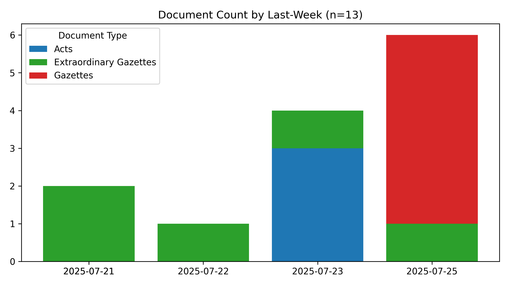

# #SriLanka 🇱🇰 - Legal Documents #Dataset

*Last Updated **2025-07-17 03:57:47**.*

**44,017** documents (40.9 MB), from 1981-01-22 to 2025-07-14.

A collection of 📢 Gazettes, 🚨 Extraordinary Gazettes, 🏛️ Acts, ✍️ Bills and more,  from [documents.gov.lk](https://documents.gov.lk).

🆓 **Public** data, fully open-source – fork freely!

🗣️ **Tri-Lingual** - සිංහල, தமிழ் & English

🔍 **Useful** for Journalists, Researchers, Lawyers & law students, Policy watchers & Citizens who want to stay informed

🐞 **#WorkInProgress** - Suggestions, Questions, Ideas, [Bug Reports](https://github.com/nuuuwan/lk_legal_docs/issues) are welcome!

#Legal #OpenData #GovTech

📄 Currently, 39,768 PDFs (16.6 GB) for **14,447** documents (32.8%) have been downloaded. Final data size is estimated to be ~51 GB.

## 🆕 The Legal Documents App

You can browse this dataset using [http://nuuuwan.github.io/lk_legal_docs_app/](http://nuuuwan.github.io/lk_legal_docs_app/).

For best results, use a desktop browser.

## Summary Statistics

| doc_type | n | min_date | max_date |
| :-- | --: | :-- | :-- |
| 🚨 Extraordinary Gazettes | 34,747 | 2010-01-01 | 2025-07-14 |
| 📢 Gazettes | 6,275 | 2006-03-03 | 2025-07-11 |
| ✍️ Bills | 1,348 | 2010-05-10 | 2025-07-08 |
| 🏛️ Acts | 1,647 | 1981-01-22 | 2025-06-20 |

## Summary Charts

## Recent Documents (Published during the last 7 days)

**16** Documents

- 🚨 [2025-07-14] [2445/05](https://github.com/nuuuwan/lk_legal_docs_data/tree/main/data/extra-gazettes/2025/2445-05)
- 🚨 [2025-07-14] [2445/04](https://github.com/nuuuwan/lk_legal_docs_data/tree/main/data/extra-gazettes/2025/2445-04)
- 🚨 [2025-07-14] [2445/03](https://github.com/nuuuwan/lk_legal_docs_data/tree/main/data/extra-gazettes/2025/2445-03)
- 🚨 [2025-07-14] [2445/02](https://github.com/nuuuwan/lk_legal_docs_data/tree/main/data/extra-gazettes/2025/2445-02)
- 🚨 [2025-07-14] [Sri Lanka Customs - Rates of Exchange with effect from 14.07.2025 to 20.07.2025](https://github.com/nuuuwan/lk_legal_docs_data/tree/main/data/extra-gazettes/2025/2445-01)
- 🚨 [2025-07-11] [Election Commission - Notice under Section 66 (2) Elected to Members for 08 L.G Institutions](https://github.com/nuuuwan/lk_legal_docs_data/tree/main/data/extra-gazettes/2025/2444-60)
- 📢 [2025-07-11] [Legal Section](https://github.com/nuuuwan/lk_legal_docs_data/tree/main/data/gazettes/2025/2025-07-11-legal-section)
- 📢 [2025-07-11] [Land Section](https://github.com/nuuuwan/lk_legal_docs_data/tree/main/data/gazettes/2025/2025-07-11-land-section)
- 📢 [2025-07-11] [IV (B) - Local Government](https://github.com/nuuuwan/lk_legal_docs_data/tree/main/data/gazettes/2025/2025-07-11-iv-b-local-government)
- 📢 [2025-07-11] [IV (A) - Provincial Councils](https://github.com/nuuuwan/lk_legal_docs_data/tree/main/data/gazettes/2025/2025-07-11-iv-a-provincial-councils)
- 📢 [2025-07-11] [(III) - TRADE MARKS AND PATENT NOTICES](https://github.com/nuuuwan/lk_legal_docs_data/tree/main/data/gazettes/2025/2025-07-11-iii-trade-marks-and-patent-notices)
- 📢 [2025-07-11] [(IIB) - Advertising](https://github.com/nuuuwan/lk_legal_docs_data/tree/main/data/gazettes/2025/2025-07-11-iib-advertising)
- 📢 [2025-07-11] [(IIA) - Advertising](https://github.com/nuuuwan/lk_legal_docs_data/tree/main/data/gazettes/2025/2025-07-11-iia-advertising)
- 📢 [2025-07-11] [(I) - General](https://github.com/nuuuwan/lk_legal_docs_data/tree/main/data/gazettes/2025/2025-07-11-i-general)
- 🚨 [2025-07-09] [Department of Local Government - Southern Province - Notice Under Section 66 C (1) Appointed Mayor, Deputy Mayor, Chairman and Vice Chairman for 14 L.G. Institutions](https://github.com/nuuuwan/lk_legal_docs_data/tree/main/data/extra-gazettes/2025/2444-31)
- 🚨 [2025-07-09] [2444/26](https://github.com/nuuuwan/lk_legal_docs_data/tree/main/data/extra-gazettes/2025/2444-26)
